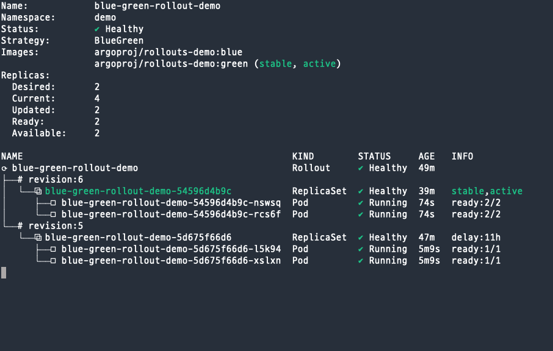
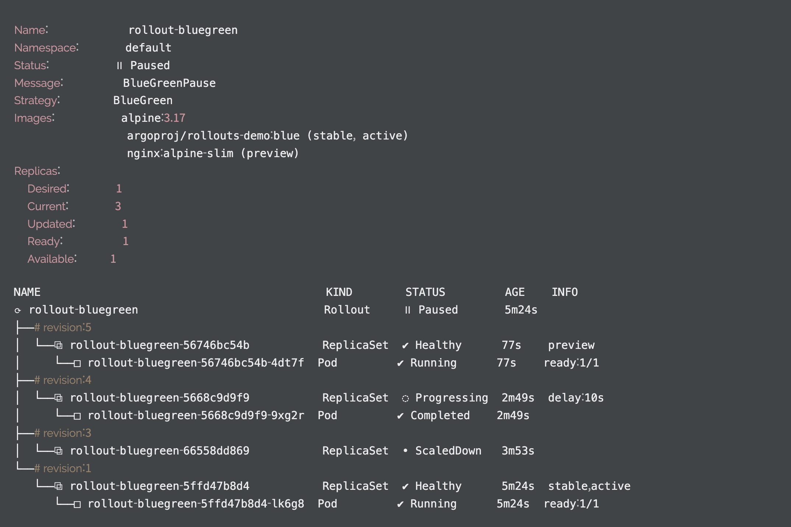

# argo rollouts와 istio로 deployment 구현하기

## 실제 운영 적용을 위해 고려 사항

- Blue/Green 버전 간 트래픽을 실시간으로 스위칭이 가능한가
- promote 이후 신규 버전에서 이슈가 발생하면 빠른 롤백을 위해 기존 버전이 유지되는가
- preview(e.g, green) pod의 자원 사용량 부담 (리소스 절감 차원)
- 새로운 배포 버전에 문제가 생겼을 경우 그 배포 이미지를 교체할 수 있는가

## Blue/Green 버전 간 트래픽을 실시간으로 스위칭 가능한가

argo rollouts는 기본적으로 2개의 서비스를 갖고 상황에 따라 2개의 서비스가 하나의 배포를 가리키기도, 각각의 배포를 가리키기도 한다.

실제 트래픽은 무조건 active 서비스로 연결하고, 테스트를 위한 트래픽은 preview로 연결되도록 고정해두면 서비스를 스위칭할 필요가 없어진다. → 요청하는 쪽에서 어떤 서비스를 호출할지 명확히 알아야 함

## Promote 후 기존 버전의 유지 여부

promote 후에도 이전 버전 replicaSet이 유지가 되므로 롤백 가능하다. 

→ 이전 버전 pod이 생성되는 동안 down time 발생 가능하지 않나

rollouts의 spec 중 `scaleDownDelaySeconds` 옵션에서 이전 버전의 replicaSet이 scale down되는 것을 지연시키는 설정이 있다.(기본 30초)

## preview 버전의 자원 사용량에 대한 부담

blu/green 배포를 하면 동시에 두 버전이 떠있는 시점이 있게 되는데, 이때 많은 pod로 구성되는 서비스라면 리소스 사용량에 부담을 가질 수 있다.

rollouts에서는 spec 중 `previewReplicaCount`라는 값으로 preview 버전의 pod 갯수를 지정할 수 있다. 이를 통해 preview 버전의 리소스 사용량 부담을 줄일 수 있다.

## preview 버전 교체 가능 여부

preview 버전을 테스트 중에 오류를 발견해 새로운 Preview버전으로 바꾸는 경우가 있다.

이 경우 이미지를 바꿔서 차트를 업데이트하면, 배포중이던 preview 버전은 scale down되고 새로운 preview 이미지가 배포된다. 

`revisionHistoryLimit`에서 저장하고 있을 revision 갯수를 지정할 수 있다.

위 그림은 revision1에 active 상태인 버전이 있고, 

revisionHistory를 2로 설정하여 3, 4버전만 남고 2가 삭제 되었음을 볼 수 있다.

---

## 개인적인 생각 정리

Blue/Green 배포를 하는 상황에 한하여 꼭 istio를 써야만 blue green 배포를 할 수 있는가?

→ deployment 2개를 만들고 Blue, Green으로 라벨링한 뒤, Service에서 selector를 원하는 시점에 원하는 라벨로 변경하여 트래픽 전환 가능

→ 따라서 요청의 특정 규칙에 따른 라우팅이나, weight 기반 라우팅이 아닌 blue/green일 경우 Istio가 필요하지 않음

왜 deployment가 아닌 rollouts로 배포하는가?

→ 수작업이 들어가고 같은 deployment를 2개 생성해야 한다. 

→ 일반적으로 이미지의 값만 다를 것이기 때문에 중복 코드가 많다.

→ 따라서 실수의 위험성이 크게 존재